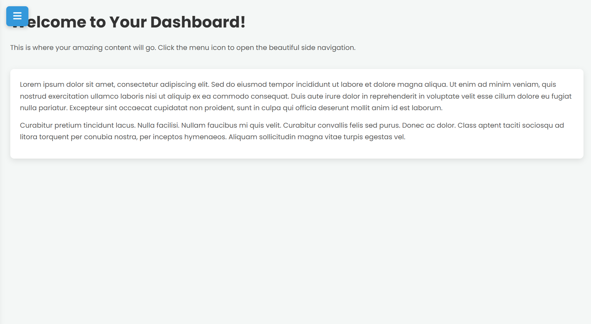

# AeroNav (GoogleGemini) 

"AeroNav" is a meticulously crafted web component designed to elevate user interaction with a sleek, intuitive, and highly functional side navigation. Moving beyond conventional static menus, AeroNav glides into view with smooth animations and a refined aesthetic, creating a delightful user experience.

## Live Project :  
https://AICOMp-sketch.github.io/AeroNav/Source%20Code